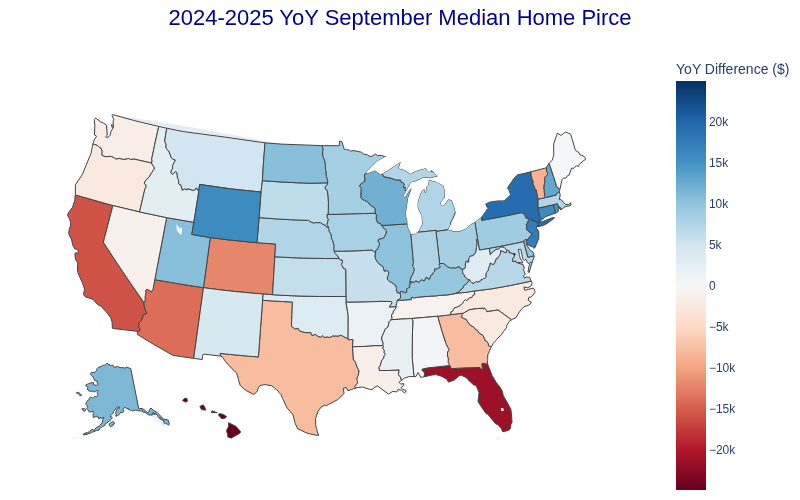

# U.S. Housing Historical Median Price Analysis 🏠📊

This project contains a Jupyter Notebook that performs an analysis of **U.S. housing historical median prices** using data sourced from **Zillow Research**. The analysis focuses on visualizing price trends at both the state and county levels.

The data used comes from Zillow's publicly available historical price data, specifically the **Zillow Home Value Index (ZHVI)** for All Homes (SFR, Condo/Co-op) $\le$ 75th percentile.

-----

## Notebook Sections

The analysis is structured into the following three main sections within the Jupyter Notebook:

### 1\. Data Acquisition and Parsing 💾

  * **Reads and processes** the historical median price data from two separate tables/files: one containing **state-level** data and another with **county-level** data.
  * The data is cleaned and prepared for subsequent analysis, ensuring proper date formatting and numerical integrity.

### 2\. State-Level Analysis 🗺️📈

  * **Year-over-Year (YoY) Price Change Map:** Visualizes the most recent YoY percentage change in median home prices for **all U.S. states** using a choropleth map. This provides a quick geographical overview of price momentum.
  * **Median Price History Line Plot:** Displays the **historical median price trend** over time for selected or all states using a line plot, allowing for comparison of long-term growth trajectories.


_September 2025 YoY median home price change_

### 3\. New Jersey County-Level Deep Dive 📍 NJ

  * **New Jersey YoY Price Change Map:** Focuses on a granular view by mapping the most recent YoY percentage change in median home prices for **all counties within New Jersey (NJ)**.
  * **New Jersey County Median Price History Line Plot:** Plots the **historical median price trend** over time for individual counties in New Jersey, enabling detailed comparison of local market performance within the state.

-----

## Data Source

The data utilized in this analysis is the **Zillow Home Value Index (ZHVI)**, sourced directly from the Zillow Research Data page:

  * **Source URL:** [https://www.zillow.com/research/data/](https://www.zillow.com/research/data/)
  * **Specific Data Used:** Zillow Home Value Index (ZHVI) for All Homes (SFR, Condo/Co-op) $\le$ 75th percentile (or similar historical monthly/quarterly price index data).

-----

## Requirements

To run this analysis, you'll need the following libraries, which can typically be installed via `pip`:

  * `pandas`
  * `numpy`
  * `plotly`
  * `jupyterlab` 
  * `ipykernel` 

<!-- end list -->

```bash
# Example environment setup
pip install pandas numpy plotly jupyterlab ipykernel
```

-----

## Getting Started

1.  **Clone the repository:**
    ```bash
    git clone https://github.com/KuoLiang-hub/housing_prices_analysis
    cd housing_prices_analysis
    ```
2.  **Download the data:** Obtain the relevant State and County level ZHVI data files (usually `.csv` format) from the Zillow Research website and place them in a dedicated `data/` folder (or adjust the file paths in the notebook).
3.  **Launch the Jupyter Notebook:**
    ```bash
    jupyter lab .
    ```
4.  **Run the cells** sequentially to reproduce the analysis and visualizations.